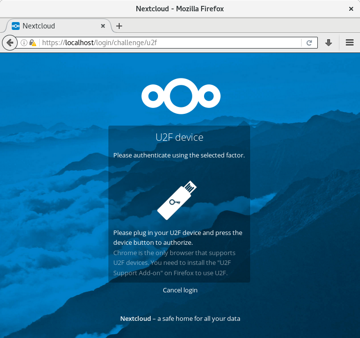

# U2F second factor provider for Nextcloud

Master:

1.5.x:

# Requirements
In order to use this app for authentication, you have to use a browser that supports the U2F standard:
* Google Chrome
* Chromium
* Firefox in combination with [this extension](https://addons.mozilla.org/en-US/firefox/addon/u2f-support-add-on/)
* Opera

## Login with external apps
Once you enable U2F with Two Factor U2F, your aplications (for example your Android app or your GNOME app) will need to login using device passwords. To manage it, [know more here](https://docs.nextcloud.com/server/11/user_manual/session_management.html#managing-devices)
